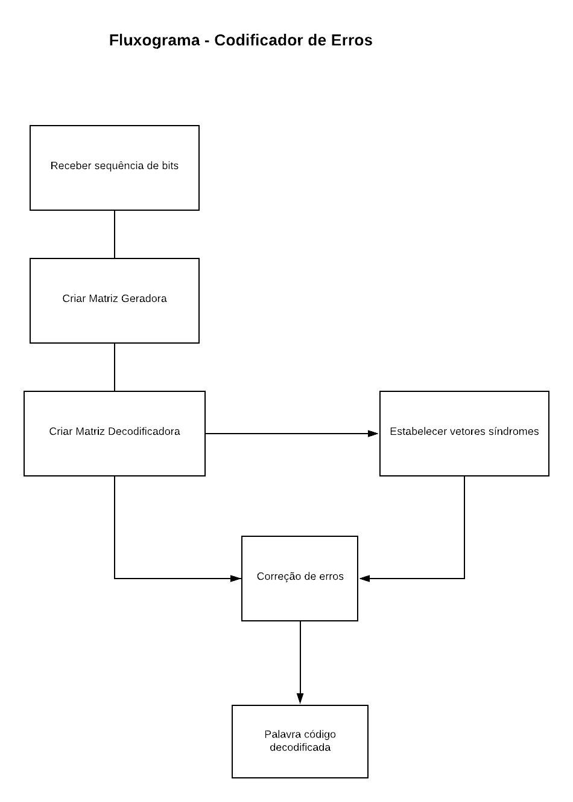
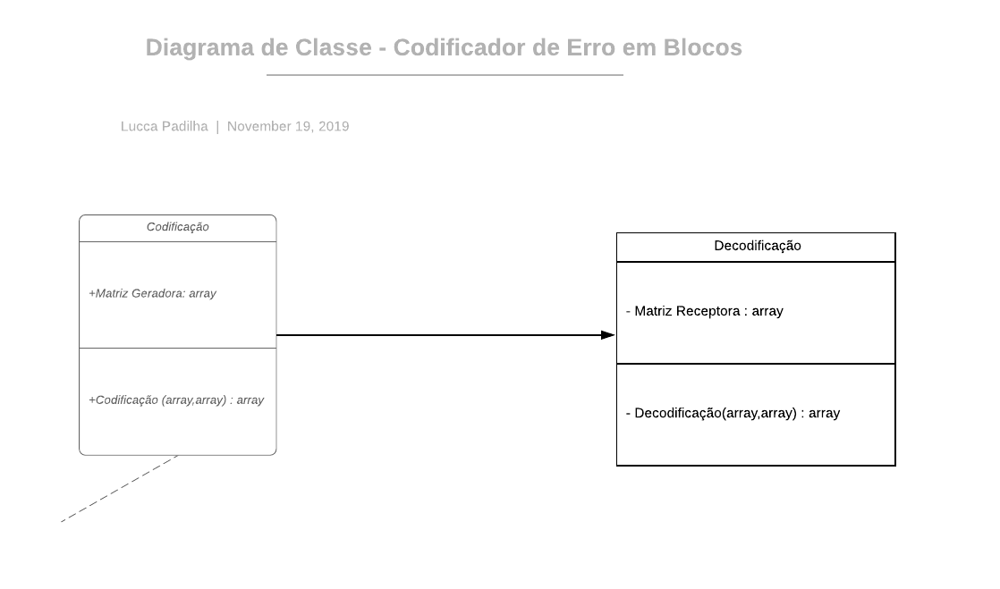

# Codificação de Erro em blocos

Se trata de criar dois blocos no GNURadio, um responsável pela codificação e outro pela decodificação para diminuir a probabilidade de erro na codificação de bits.

## Resumo

O bloco a ser construído possuirá classes a serem definidas, com as matrizes de código como atributos. 
O código também herda algumas classes do próprio GNURadio, que são úteis para o controle do fluxo de dados (entrada do bloco e saída). 
O bloco poderá ser inserido em uma modulação, no instante do recebimento da sequência e analogamente na decodificação dos bits.
Uma comparação de desempenho pode ser feita, comparando a taxa de erros com e sem a implementação do codificador de erro em blocos.

## Suporte de Browsers/Software

O link abaixo é um tutorial que mostra quais classes já devem ser incluídas e cria o esqueleto delas em C++ ou Python com as heranças necessárias:
https://wiki.gnuradio.org/index.php/Guided_Tutorial_GNU_Radio_in_C%2B%2B#4.2_Maneuvering_our_OOT_module

Este segundo link é um tutorial que explica como analisar o código de cada flowgraph e quais alterações podem ser
feitas de modo que o bloco execute as operações que desejarmos.
https://wiki.gnuradio.org/index.php/Guided_Tutorial_GNU_Radio_in_Python

##  Equipe
 LinkedIn:https://www.linkedin.com/in/lucca-padilha-218513140
 

# O Projeto

## Pré requisitos
 
### GNURadio 
Para o início do projeto é necessário fazer o download do software GNURadio, que pode ser feito através do link:
http://www.gcndevelopment.com/gnuradio/downloads.htm
Basta selecionar a versão da máquina no qual será instalado.

### Python
A versão mais recente do Python pode ser baixada no link abaixo:
https://www.python.org/downloads/
### IDLE
Para o projeto foi utilizado o _Sublime Text_ , que pode ser baixado no link:
https://www.sublimetext.com/3

## Desenvolvimento

### Fluxograma

A sequência lógica do programa funciona como ilustrado na figura abaixo:

### Diagrama de classes

O diagrama de classes do programa está representado na figura abaixo:

